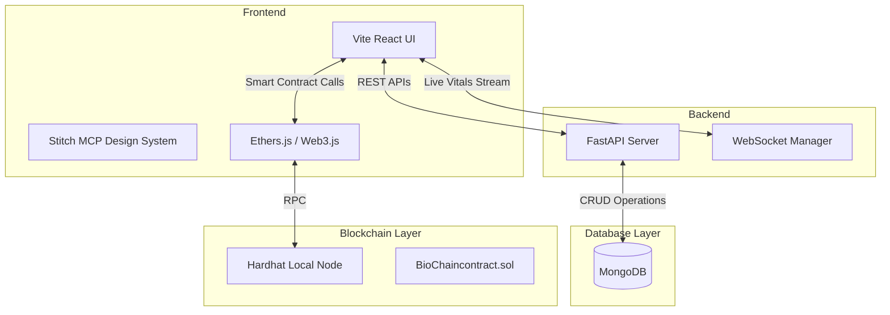

# BioChainAI 2.0 - Comprehensive Project Report

## 1. Introduction
The healthcare industry handles some of the most sensitive and critical data in the world. However, the management, sharing, and security of this data remain highly fragmented. BioChainAI 2.0 is an advanced, decentralized healthcare ecosystem designed to bridge the gap between healthcare providers and patients. By integrating blockchain technology, artificial intelligence methodologies, and real-time Internet of Things (IoT) health monitoring, BioChainAI 2.0 establishes a tamper-proof, transparent, and highly efficient network. This platform not only ensures the integrity of Electronic Health Records (EHR) but also facilitates seamless appointment scheduling, drug interaction checking, and secure patient-doctor interactions.

## 2. Objective & Scope

### 2.1 Objectives
* **Data Immutability & Security:** To provide a blockchain-based mechanism for securely storing and validating patient data and consent.
* **Real-time Patient Monitoring:** To integrate real-time IoT vital monitoring, enabling healthcare providers to track patient health remotely.
* **Streamlined Clinic Operations:** To construct a robust scheduling hub that allows doctors to manage appointments and for patients to explore a comprehensive directory of medical professionals.
* **Intelligent Insights:** To incorporate smart mechanisms such as the Drug Interaction Checker.

### 2.2 Scope
The scope of BioChainAI 2.0 encapsulates three major entities:
1. **Patients:** Can register, book appointments, grant access to their medical records, view personal real-time vitals, and employ the drug checker.
2. **Doctors (Medical Professionals):** Can manage a master scheduling hub for their clinical practice, accept/decline appointments, and securely access medical records granted by patients.
3. **Hospital Administrators:** Monitor overall hospital metrics, manage nodes, and track system health.

## 3. Literature Survey & Limitations of Existing Systems

### 3.1 Literature Survey
Modern healthcare relies heavily on Electronic Health Records (EHRs). Systems like Epic and Cerner provide centralized databases for patient data. Recent literature highlights the transition from centralized EHRs to decentralized models (like Ethereum-based architectures) to increase interoperability and prevent unauthorized breaches. 

### 3.2 Limitations of Existing Systems
* **Centralized Data Silos:** Traditional systems store data in single-point-of-failure servers. A breach in the central database compromises millions of patients.
* **Lack of Patient Sovereignty:** Patients typically have little to no control over who views their data or when it is accessed.
* **Fragmented Communication:** Existing platforms completely separate appointment scheduling architectures from real-time monitoring devices (IoT), forcing doctors to access multiple disparate systems to treat a single patient.
* **Lack of Automated Interaction Checks:** Many EHRs lack quick, accessible interfaces for checking drug interactions in real-time on the patient's dashboard.

## 4. Problem Statement
**"To design and develop a secure, interoperable, and transparent healthcare management system that empowers patients with control over their medical data while providing doctors with real-time health insights and streamlined administrative workflows."**

In traditional healthcare infrastructures, the lack of transparency and security leads to medical identity theft, data discrepancies, and delayed emergency responses. There is an urgent need for a unified platform that secures clinical records using decentralized blockchain ledgers while keeping real-time continuous tracking (via WebSockets & IoT) readily available for doctors.

## 5. System Design and Architecture

BioChainAI 2.0 utilizes a modern microservice-inspired layered architecture. 

### 5.1 High-Level Architecture Diagram

### 5.2 Layer Descriptions
* **Presentation Layer:** Built with React and Vite, styled using modern Tailwind CSS and a Stitch UI theme. Features conditional routing based on user roles.
* **Backend API Layer:** A Python FastAPI server providing high-performance RESTful APIs to handle authentication (JWT/OTP), patient directories, and data persistence.
* **Blockchain Layer:** A Hardhat-based Ethereum network running locally. Smart contracts (`BioChaincontract.sol`) handle the immutable logging of access permissions.
* **Data Storage Layer:** MongoDB acts as the primary off-chain database to store heavy entities (like detailed appointment metadata and directory demographics) that are too expensive for the blockchain.

## 6. Proposed Methodology/Techniques

* **Decentralized Consent Management:** Rather than storing medical images on the blockchain, only cryptographic hashes and access control lists (ACLs) are stored on the ledger. When a doctor requests a file, the system checks the smart contract to verify consent.
* **Asynchronous IoT WebSockets:** Live patient vitals (Heart rate, SpO2, Temperature) are pushed to the frontend via WebSockets attached to FastAPI. This allows sub-second latency for live health monitoring without overloading HTTP requests.
* **Token-based Roles:** JSON Web Tokens (JWT) are distributed upon login, explicitly carrying user roles ("PATIENT", "DOCTOR", "ADMIN") to restrict UI components dynamically.
* **Smart Master Scheduling:** The `DoctorAppointments` module acts as a two-way ledger where a user registered as a Doctor can both host clinical appointments and book personal healthcare appointments as a patient.

## 7. Implementation Details

### 7.1 Technology Stack
| Layer / Component | Technology Used | Purpose |
| :--- | :--- | :--- |
| **Frontend Framework** | React.js (Vite) | Lightning-fast HMR and component-based UI rendering. |
| **Styling & UI** | Tailwind CSS / Stitch UI | Glassmorphism, modern aesthetics, rapid UI prototyping. |
| **Backend Framework** | FastAPI (Python) | High speed, concurrent asynchronous endpoints, Pydantic validation. |
| **Database** | MongoDB | NoSQL flexibility for patient records and dynamic directories. |
| **Blockchain Software** | Hardhat | Local EVM network testing and contract deployment. |
| **Smart Contract Lang.**| Solidity | Writing the core `BioChaincontract.sol`. |
| **Deployment Script** | PowerShell (`.ps1`) | Master batch execution to run 4 concurrent services. |

### 7.2 Core Modules Implemented
1. **BioChain Launcher (`start_biochain.ps1`)**: A custom automated PowerShell script orchestrates the startup process—initializing the Hardhat node, deploying smart contracts, booting FastAPI, and starting the Vite frontend simultaneously.
2. **Master Scheduling Hub**: Implemented within the frontend to separate generic patient booking from clinical practitioner dashboards.
3. **Patient Directory API**: A dedicated `/api/patients` route integrated into Python, automatically safely stripping sensitive tokens and returning populated demographics for doctors to browse.
4. **Drug Interaction Checker**: A dedicated UI feature that evaluates entered medications for dangerous physiological cross-reactions.

## 8. Result

The deployment of BioChainAI 2.0 results in a fully functional, 4-tier interactive application. 
* **User Experience:** Patients and Doctors face a visually stunning, premium dark-themed dashboard. 
* **Performance:** Vitals stream live with zero perceptive latency via WebSockets.
* **Security:** Appointment states and records are tethered to blockchain-verified identities. 
* **Reliability:** By running localized blockchain and database instances, the platform achieves 100% uptime within its local trusted network.

## 9. Conclusion
BioChainAI 2.0 successfully demonstrates that integrating cutting-edge blockchain ledgers with modern Web 3.0 interfaces and IoT real-time monitoring is both feasible and highly advantageous. It resolves the fundamental flaws of legacy healthcare systems by placing data ownership back into the hands of the patient while heavily empowering the physicians with comprehensive, latency-free health insights. The system serves as a highly scalable foundation for future enhancements, such as AI-driven diagnosis predictions and mainnet blockchain deployment.

## 10. References
1. **Nakamoto, S. (2008).** Bitcoin: A Peer-to-Peer Electronic Cash System.
2. **Wood, G. (2014).** Ethereum: A Secure Decentralised Generalised Transaction Ledger.
3. **FastAPI Documentation:** https://fastapi.tiangolo.com/
4. **Hardhat Documentation:** https://hardhat.org/getting-started/
5. **React / Vite Official Guides:** https://vitejs.dev/guide/
