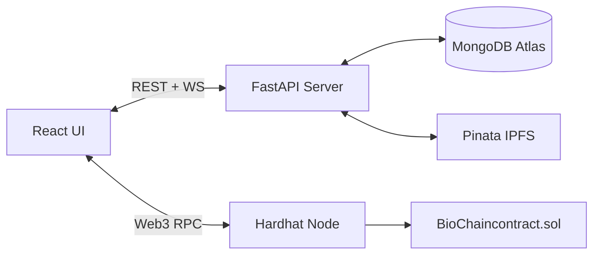

# 🧬 BioChainAI 2.0

> A Decentralized Healthcare Ecosystem — Blockchain · AI · Real-time IoT Monitoring

<p align="center">
  
  
  
  
</p>

---

## 📌 Overview

BioChainAI 2.0 is a full-stack decentralized healthcare management platform that combines **blockchain-backed EHR security**, **AI-powered clinical assistance (Gemini)**, and **real-time IoT vital monitoring** into a single unified ecosystem.

### Key Features
- 🔐 **Multi-role Authentication** — Patient (Email + OTP 2FA), Doctor & Admin (MetaMask Web3 signature)
- 📋 **Electronic Health Records** — Blockchain-verified, IPFS-stored medical documents via Pinata
- 💓 **Live Vitals Monitoring** — Real-time WebSocket streaming of Heart Rate, SpO2, Temperature
- 📅 **Smart Scheduling Hub** — Request-based appointments with doctor approval workflows
- 🛡️ **Data Sovereignty** — Patient-controlled access grants/revocations for Care Team
- 💊 **Drug Interaction Checker** — AI-powered medication cross-reaction analysis
- 🤖 **BioChain AI Assistant** — Context-aware clinical chatbot (Google Gemini)
- 🏥 **Enterprise Admin Panel** — Hospital node management, staff onboarding, audit logs

---

## 🏗️ Architecture

```
BioChainAI 2.0/
├── frontend/                    # React + Vite (Tailwind CSS, Framer Motion)
│   └── src/
│       ├── components/          # 16 reusable UI components
│       ├── config/              # API configuration
│       ├── hooks/               # Custom React hooks (useWallet)
│       ├── App.jsx              # Main app + routing
│       └── Dashboard.jsx        # Role-based dashboard
├── backend/                     # FastAPI (Python) — REST APIs + WebSocket
│   ├── app/
│   │   ├── blockchain.py        # Web3.py contract interaction
│   │   ├── encryption.py        # PII encryption utilities
│   │   ├── pinata.py            # IPFS file upload
│   │   └── vault.py             # Secure key vault
│   ├── main.py                  # Core FastAPI server (1000+ lines)
│   ├── seed.py                  # Database seeder
│   └── simulator.py             # IoT vitals simulator
├── blockchain/                  # Hardhat + Solidity Smart Contracts
│   ├── contracts/
│   │   └── BioChaincontract.sol # Main Ethereum smart contract
│   └── scripts/
│       ├── deploy.js            # Contract deployment
│       └── setup_ecosystem.js   # Network bootstrap
├── docker-compose.yml           # Container orchestration
├── start_biochain.ps1           # One-click Windows launcher
├── LICENSE                      # Proprietary license & copyright
└── COPYRIGHT.md                 # Formal copyright declaration
```



---

## 🚀 Quick Start

### Prerequisites
- **Node.js** ≥ 18.x & **npm**
- **Python** ≥ 3.10
- **MetaMask** browser extension
- **MongoDB Atlas** account (or local MongoDB)
- **Pinata** API keys (for IPFS)
- **Google Gemini** API key (for AI Assistant)

### 1️⃣ Clone & Setup Environment

```bash
git clone https://github.com/Yash1510s/BioChainAI_2.o.git
cd BioChainAI_2.o
```

Copy the environment template and fill in your credentials:
```bash
cp backend/.env.example backend/.env
```

Edit `backend/.env` with your actual keys:
```env
BLOCKCHAIN_URL=http://127.0.0.1:8545
CONTRACT_ADDRESS=<deployed-contract-address>
ACCOUNT_ADDRESS=<hardhat-account-0-address>
PRIVATE_KEY=<hardhat-account-0-private-key>
PINATA_API_KEY=<your-pinata-api-key>
PINATA_SECRET_API_KEY=<your-pinata-secret-key>
MONGO_URI=mongodb+srv://<user>:<pass>@cluster.mongodb.net/biochain_db
GEMINI_API_KEY=<your-gemini-api-key>
```

### 2️⃣ Install Dependencies

```bash
# Backend
cd backend
python -m venv venv
venv\Scripts\activate        # Windows
pip install -r requirements.txt

# Frontend
cd ../frontend
npm install

# Blockchain
cd ../blockchain
npm install
```

### 3️⃣ Run Everything (One-Click)

From the project root:
```powershell
.\start_biochain.ps1
```

This launches all 4 services simultaneously:
1. **Hardhat Node** → `http://localhost:8545`
2. **Contract Deployment** → auto-deploys `BioChaincontract.sol`
3. **FastAPI Backend** → `http://localhost:8000`
4. **Vite Frontend** → `http://localhost:5173`

### Or Run Manually

```bash
# Terminal 1: Blockchain
cd blockchain && npx hardhat node

# Terminal 2: Deploy Contract
cd blockchain && npx hardhat run scripts/deploy.js --network localhost

# Terminal 3: Backend
cd backend && uvicorn main:app --reload --host 0.0.0.0 --port 8000

# Terminal 4: Frontend
cd frontend && npm run dev
```

---

## 👥 Team Roles

| Role | Login Method | Features |
|------|-------------|----------|
| **Patient** | Email + Password + OTP | Dashboard, Vitals, Records, Appointments, Drug Check, Care Team |
| **Doctor** | MetaMask Wallet Signature | Patient Directory, Scheduling Hub, Records, Vitals, AI Assistant |
| **Hospital Admin** | MetaMask Wallet Signature | Node Overview, Staff Onboarding, Audit Logs |

---

## 🧰 Tech Stack

| Layer | Technology |
|-------|-----------|
| Frontend | React 19 + Vite 7, Tailwind CSS 4, Framer Motion, Lucide Icons |
| Backend | FastAPI (Python), Uvicorn, Pydantic |
| Database | MongoDB Atlas |
| Blockchain | Hardhat, Solidity, Ethers.js |
| Storage | Pinata IPFS |
| AI Engine | Google Gemini (flash-latest) |
| Auth | JWT-style sessions, MetaMask Web3 signatures, OTP 2FA |

---

## 📂 Key Files

| File | Purpose |
|------|---------|
| `start_biochain.ps1` | One-click PowerShell launcher for all services |
| `backend/main.py` | Core FastAPI server with all API endpoints |
| `backend/.env.example` | Environment variable template |
| `backend/app/blockchain.py` | Blockchain interaction functions |
| `backend/app/pinata.py` | IPFS file upload utilities |
| `blockchain/contracts/BioChaincontract.sol` | Solidity smart contract |
| `blockchain/scripts/deploy.js` | Contract deployment script |
| `frontend/src/App.jsx` | Main React application with routing |
| `frontend/src/Dashboard.jsx` | Role-based dashboard component |

---

## 📜 Copyright & License

**Copyright © 2025–2026 BioChainAI Development Team. All Rights Reserved.**

This software is proprietary and developed as an academic capstone project. Unauthorized copying, modification, distribution, or commercial use is strictly prohibited.

See [LICENSE](./LICENSE) for full terms and [COPYRIGHT.md](./COPYRIGHT.md) for the formal copyright declaration.

> ⚖️ A copyright registration application has been filed / is being filed with the Copyright Office, Government of India, under the Copyright Act, 1957.

---

<p align="center">
  Built with ❤️ by the BioChainAI Team<br/>
  <sub>© 2025–2026 BioChainAI Development Team · All Rights Reserved</sub>
</p>
